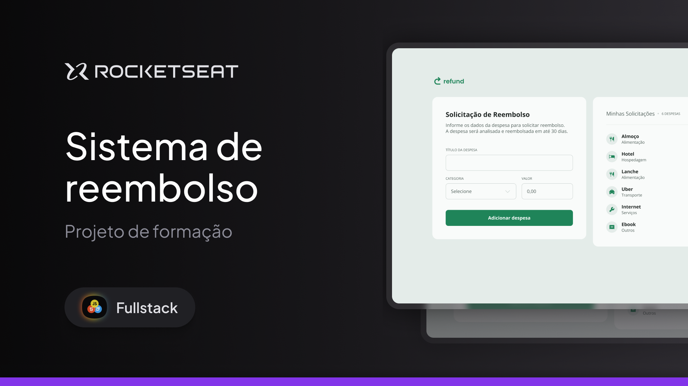

<h1 align="center">
  
</h1>

## Projeto 💻

Refund é uma aplicação web de solicitação de reembolso e listagem de despesas.

Esse é um dos projetos desenvolvidos em aula na formação de Javascript, um de nossos conteúdos de especialização.

## Tecnologias

Esse projeto foi desenvolvido com as seguintes tecnologias

- HTML
- CSS
- JavaScript

---

## Acessar o Projeto

Para acessar o projeto, basta clicar neste link abaixo:  
<a href="https://pduartesilva2005.github.io/refund/" target="_blank">Ver o projeto online!</a>

Criado por Pedro Duarte
